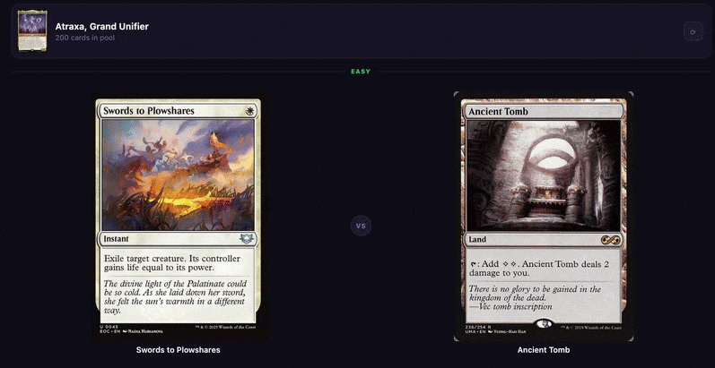

# MTG Cascade

Guess which card sees more play in a given commander's decks.

**[Play here!](https://mcgeever1.github.io/mtg-cascade/)**

---

This is a vibe-coded game I made with a friend one afternoon when discussing which cards saw more play in modern magic. It was made using Claude Code. Its rules are simple:

Pick between two cards — whichever shows up in more EDHREC decks wins. Gets harder the longer your streak goes. A wrong answer means a new commander. 

Deckbuilding data pulled live from [EDHREC API](https://edhrec.com). Card data pulled from [Scryfall API](https://scryfall.com/).

A more in-depth explanation of the difficulty scaling, as well as edge cases can be found in the technical breakdown available [here.](https://mcgeever1.github.io/projects/2-project)

Any suggestions? email me here: [mcgeever.e@northeastern.edu](mailto:mcgeever.e@northeastern.edu)

MIT Licensed
